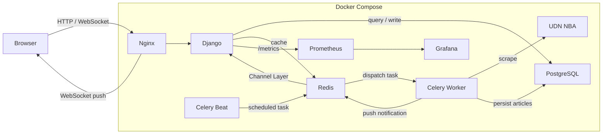

# News Ingestion Platform

A Django-based backend system that performs scheduled news scraping, persists articles to PostgreSQL, serves them via a REST API with Redis caching, and pushes real-time WebSocket notifications when new content arrives — all orchestrated through Docker Compose with full observability via structured logging, Prometheus metrics, and Grafana dashboards.

## Highlights

- **Staged scraping pipeline** — pluggable `NewsSource` protocol with a five-stage runner (`discover → fetch → parse → persist → notify`), making it easy to add new sources
- **Scheduled scraping with Celery Beat** — hourly two-phase crawl (listing page → article page) with `source_url`-based deduplication
- **PostgreSQL persistence** — single `News` model with unique constraint for automatic dedup on insert
- **Redis for cache and message broker** — API response cache (TTL 60 s), Celery broker, and Django Channels layer on one Redis instance isolated by DB number
- **WebSocket notifications** — browser clients on the list page receive real-time pushes when the scraper ingests new articles
- **Observability** — structlog JSON logging with per-run correlation IDs, Prometheus counters and histograms exposed at `/metrics`, and a pre-provisioned Grafana dashboard for pipeline health
- **Docker Compose deployment** — eight-service stack (web, db, redis, celery_worker, celery_beat, nginx, prometheus, grafana) with one-command startup
- **Load-tested API for 100 QPS** — Gunicorn + Uvicorn multi-worker ASGI setup achieves 99.6 req/s with p95 latency of 34 ms under k6 constant-arrival-rate testing

## System Architecture



**Data flow at a glance:**

1. **Scrape & persist** — Celery Beat dispatches a scraping task every hour via Redis. The Celery Worker runs the staged pipeline (`discover → fetch → parse → persist → notify`) against the UDN NBA source, parsing articles with BeautifulSoup and writing results to PostgreSQL. Duplicate URLs are detected via DB lookup and silently skipped.
2. **API & frontend** — Browsers reach Django through Nginx. The frontend calls `GET /api/news/` (paginated list, `content` excluded) and `GET /api/news/<id>/` (full detail) with vanilla JS `fetch()`. Redis caches the list response for 60 seconds.
3. **Real-time push** — After new articles are persisted, the Worker notifies Django via the Redis Channel Layer. Django forwards the event over WebSocket to all connected browsers, which display a toast without requiring a manual refresh.
4. **Observability** — Each pipeline stage emits structured JSON logs (via structlog) and Prometheus metrics. Prometheus scrapes the Django `/metrics` endpoint every hour. A pre-provisioned Grafana dashboard visualises article throughput, per-stage latency percentiles, error rates, and pipeline run duration.

## Tech Stack

| Category | Technology |
| --- | --- |
| Backend | Django 5.1, Django REST Framework |
| Database | PostgreSQL 16 |
| Cache / Broker | Redis 7 |
| Task Queue | Celery + Celery Beat |
| WebSocket | Django Channels + channels-redis |
| Scraper | Requests + BeautifulSoup4 (lxml) |
| Web Server | Gunicorn + Uvicorn (ASGI), Nginx reverse proxy |
| Observability | structlog (JSON logging), prometheus-client, Prometheus, Grafana |
| Containerization | Docker, Docker Compose |
| Frontend | Django Templates + JavaScript fetch API |
| Load Testing | k6 (`constant-arrival-rate` executor) |

## Local Development

### Prerequisites

- [Docker](https://docs.docker.com/get-docker/) and [Docker Compose](https://docs.docker.com/compose/install/)

### Getting started

1. **Copy the environment file**

```bash
cp .env.example .env
```

The defaults in `.env.example` work out of the box for local development. See the table below if you need to customise.

2. **Start all services**

```bash
docker compose up --build
```

This brings up eight containers:

| Service | Description |
| --- | --- |
| `web` | Django ASGI server (Gunicorn + Uvicorn) |
| `db` | PostgreSQL 16 |
| `redis` | Redis 7 (cache + Celery broker + Channel Layer) |
| `celery_worker` | Celery Worker (executes scraping tasks) |
| `celery_beat` | Celery Beat (hourly schedule) |
| `nginx` | Nginx reverse proxy (port 80) |
| `prometheus` | Prometheus server (port 9090) — scrapes `/metrics` every 1 h, 3-day retention |
| `grafana` | Grafana dashboards (port 3000) — pre-provisioned with Prometheus datasource |

On first boot the `web` container automatically runs database migrations, collects static files, and performs an initial scrape (see `entrypoint.sh`).

3. **Open the app**

- News list: http://localhost/
- Django Admin: http://localhost/admin/ (requires a superuser — see below)
- Prometheus: http://localhost:9090/
- Grafana: http://localhost:3000/ (default login `admin` / `admin`)

4. **Create an admin user** (optional)

```bash
docker compose exec web python manage.py createsuperuser
```

### Environment variables

| Variable | Description | Default |
| --- | --- | --- |
| `DJANGO_SECRET_KEY` | Django secret key | `change-me` |
| `DEBUG` | Debug mode | `True` |
| `POSTGRES_DB` | Database name | `udn_nba` |
| `POSTGRES_USER` | Database user | `postgres` |
| `POSTGRES_PASSWORD` | Database password | `postgres` |
| `POSTGRES_HOST` | Database host | `db` |
| `POSTGRES_PORT` | Database port | `5432` |

### Running the scraper manually

Celery Beat triggers the scraper every hour. To run it on demand:

```bash
docker compose exec web python manage.py scrape_news
```

The scraper runs the five-stage pipeline (`discover → fetch → parse → persist → notify`) against the UDN NBA source. A summary of new / skipped / failed articles is printed on completion.

### Running tests

```bash
docker compose exec web python manage.py test
```

Coverage includes model validation and uniqueness constraints, API pagination and 404 handling, and scraper HTML-parsing logic.

## API Reference

### List articles

```
GET /api/news/?page=1
```

Returns a paginated list (10 per page, newest first). The `content` field is excluded to reduce payload size.

### Article detail

```
GET /api/news/<id>/
```

Returns the full article including HTML body.

### WebSocket

```
ws://<host>/ws/news/
```

Clients on the list page connect to this endpoint. The server pushes a message whenever new articles are ingested.

## Observability

The scraping pipeline is instrumented with two layers — **structured logging** and **Prometheus metrics** — shared through a single `log_stage` context manager that wraps every pipeline stage with timing, error capture, and structured fields.

### Structured Logging (structlog)

Every pipeline run is assigned a unique `run_id` for log correlation. Each stage emits JSON log entries with fields such as `stage`, `source`, `duration_ms`, `url`, and `error_type`, making it straightforward to filter and trace a specific run's behaviour.

### Prometheus Metrics

Django exposes a `/metrics` endpoint (multi-process safe via `PROMETHEUS_MULTIPROC_DIR`). Four metrics are tracked:

| Metric | Type | Description |
| --- | --- | --- |
| `scraper_articles_total` | Counter | Articles processed, labelled by `source` and `outcome` (`discover`, `create`, `skip`, `fail`) |
| `scraper_stage_duration_seconds` | Histogram | Latency of each pipeline stage (`discover`, `fetch`, `parse`, `persist`, `notify`, …) |
| `scraper_stage_errors_total` | Counter | Errors per stage, labelled by `error_type` (e.g. `ConnectionError`) |
| `scraper_run_duration_seconds` | Histogram | End-to-end duration of a full pipeline run |

### Grafana Dashboard

A pre-provisioned **Scraper Pipeline** dashboard is available at `http://localhost:3000` (auto-loaded on first boot, no manual setup). It includes six panels:

- **Articles Processed (rate/min)** — time series by outcome
- **Articles Total by Source & Outcome** — stat counters
- **Stage Duration (p50 / p95 / p99)** — latency percentiles per stage
- **Stage Errors (rate/min)** — error time series by stage and error type
- **Pipeline Run Duration (p50 / p95)** — end-to-end run latency
- **Stage Error Rate** — gauge showing errors as a percentage of total articles (green / yellow / red thresholds)

## Performance Notes

The list API is designed to sustain **100 QPS** with zero errors. Key optimisations:

| Technique | Effect |
| --- | --- |
| Redis response cache (`@cache_page(60)`) | Eliminates repeated DB queries within the TTL window |
| `defer("content")` on list queries | Avoids loading large HTML bodies for the list endpoint |
| Gunicorn + Uvicorn multi-worker ASGI | Parallel request handling via pre-fork process model |
| Nginx static file serving | Offloads static assets from Django |

Load testing with [k6](https://k6.io/) at a constant 100 req/s for 30 seconds:

| Metric | Daphne (single process) | Gunicorn + 2 Uvicorn Workers |
| --- | --- | --- |
| Throughput | 95.1 req/s | 99.6 req/s |
| Avg latency | 78.65 ms | 12.34 ms |
| p95 latency | 493.99 ms | 33.96 ms (14.5× improvement) |
| Dropped iterations | 146 / 3,000 (4.9%) | 12 / 3,000 (0.4%) |
| Error rate | 0.00% | 0.00% |

Full benchmark report: [`docs/performance.md`](docs/performance.md). Architecture trade-off analysis: [`docs/tech-choice.md`](docs/tech-choice.md).

```bash
# Install k6 (macOS)
brew install k6

# Run the load test (services must be running)
k6 run tests/load_test.js
```

## Project Structure

```
news-ingestion-platform/
├── config/                      # Django project settings
│   ├── settings.py              #   Main settings (DB, DRF, Celery, Channels, Cache)
│   ├── urls.py                  #   Root URL routing
│   ├── celery.py                #   Celery configuration
│   ├── asgi.py                  #   ASGI entrypoint (HTTP + WebSocket)
│   └── wsgi.py
├── news/                        # News app
│   ├── models.py                #   News data model
│   ├── serializers.py           #   DRF serializers (list / detail)
│   ├── views.py                 #   API views + page views + /metrics endpoint
│   ├── urls.py                  #   URL routing (API + pages)
│   ├── admin.py                 #   Django Admin configuration
│   ├── tasks.py                 #   Celery async tasks
│   ├── consumers.py             #   WebSocket consumer
│   ├── routing.py               #   WebSocket URL routing
│   ├── pipeline/                #   Staged scraping pipeline
│   │   ├── base.py              #     NewsSource protocol
│   │   ├── types.py             #     ArticleData dataclass, PipelineResult
│   │   ├── runner.py            #     run_pipeline() orchestrator
│   │   ├── persist.py           #     Dedup + DB write
│   │   ├── notify.py            #     WebSocket push
│   │   ├── instrument.py        #     log_stage() context manager, Prometheus metrics
│   │   └── sources/
│   │       └── udn.py           #     UDN NBA source implementation
│   ├── management/commands/
│   │   └── scrape_news.py       #   Scraper management command
│   ├── templates/news/          #   HTML templates
│   ├── static/news/css/         #   Stylesheets
│   ├── tests/                   #   Tests
│   │   ├── test_models.py
│   │   ├── test_api.py
│   │   └── test_scraper.py
│   └── migrations/
├── prometheus/
│   └── prometheus.yml           # Prometheus scrape config (targets Django /metrics)
├── grafana/
│   ├── dashboards/
│   │   └── scraper-pipeline.json  # Pre-provisioned Grafana dashboard
│   └── provisioning/            # Auto-provisioning for datasource + dashboard
├── nginx/
│   └── default.conf             # Nginx configuration
├── tests/
│   └── load_test.js             # k6 load-test script
├── docker-compose.yml           # Docker Compose (8 services)
├── Dockerfile
├── entrypoint.sh                # Container startup (migrate + collectstatic + scrape)
├── requirements.txt
├── .env.example
└── manage.py
```

## Project Origin

This project was originally inspired by a backend take-home assignment and was later extended into an independent side project focused on backend architecture, async task processing, and deployment.
